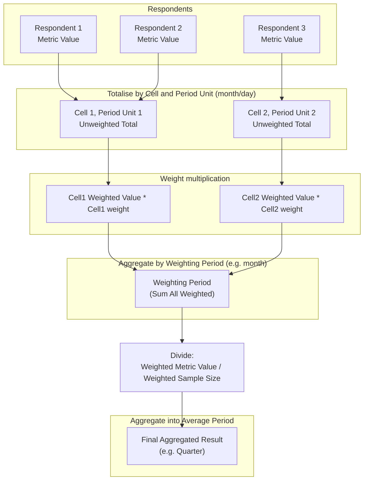
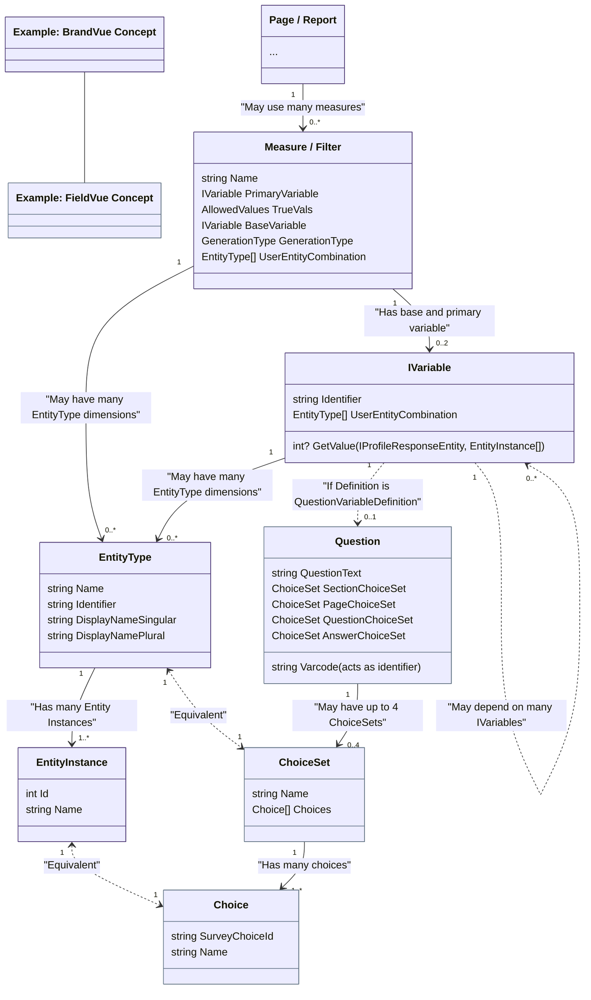
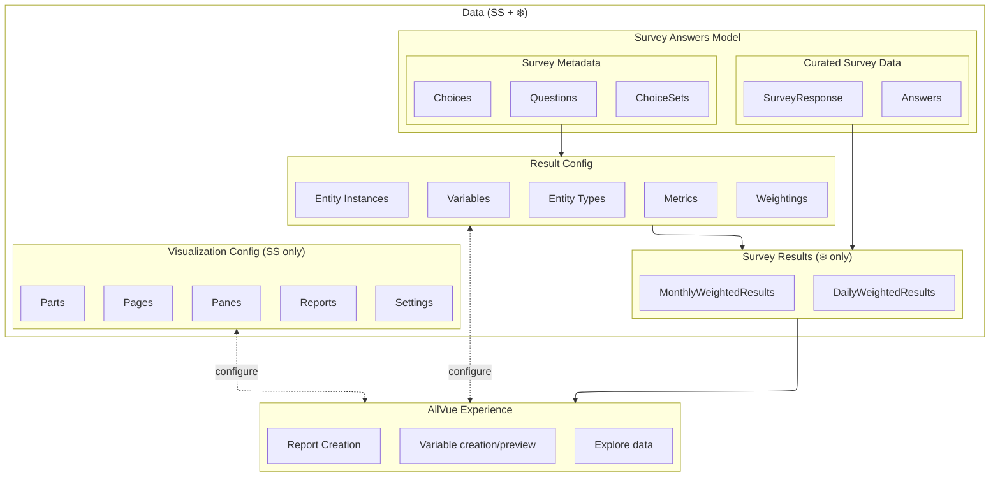

## High-level technical overview

See more general points on [high level architecture](https://github.com/Savanta-Tech/TechWiki/wiki/Code-style-and-architecture#high-level-architecture---direction)

It may be useful to understand the [question types](https://docs.savanta.com/internal/Content/Survey_Designer/Question_Types.html#single-code-vs-multi-code) we ask in our surveys

### Vue calculation engine pipeline

The core calculation is this:
```
weightedValueTotal = respondent1MetricValue * respondent1Weight + respondent2MetricValue * respondent2Weight + ...
weightedSampleSize = respondent1Weight + respondent2Weight + ...
weightedResult = weightedValueTotal / weightedSampleSize
```
The calculation pipeline:
1. Find the respondents for the right time period and filter them by the filter and any "base" of the metric.
2. Totalise: unweightedValueTotal and unweightedSampleSize per quota weighting cell (i.e. group of respondents with the same weight) within each weighting period unit (i.e. month or day)
3. Weight: Multiply by the relevant weights to get weightedValueTotal and weightedSampleSize
4. Finalise:
   * Aggregate into data points per weighting period.
   * Divide weightedValueTotal by weightedSampleSize.
   * Aggregate into data points for periods for the requested average descriptor (e.g. aggregate 3 months into a quarter).

In the codebase, see the xml doc comments on [IMetricCalculationOrchestrator](https://github.com/Savanta-Tech/Vue/blob/59bc563f896c44edfce27572201a6dea8da55260/src/BrandVue.SourceData/IMetricCalculationOrchestrator.cs#L16-L58)

### Data flow for 2 respondents through the calculation




### Concepts

We should aim to make our code demonstrate these concepts as closely as possible.

#### Variable

This is the central powerful concept of the system. The name is one used by *some* users of market research systems to represent roughly this concept.

* Returns: an integer value for a (profile, entityInstances) combination - the integer can be an entity instance id or a raw value
* Defined by: retrieves/transforms data from a single profile (can depend on other variables)
* One type of variable, question variables, correspond directly to a question in the survey. Variables can depend on other variables and incorporate various boolean logic and arithmetic.

#### Entity

Represents a discrete categorical dimension

* EntityType: The name/identity of this dimension e.g. Brand
* EntityInstances: All the id/name pairs within a given type e.g. Tesco/Asda
* Most entities correspond to a choice set in a survey, though they can also be created by a variable, e.g. to group two survey choices together as one


#### Filter

* Returns: a boolean value for a profile
* Defined by: variable, entityInstances and "true values"
* In the code: There isn't a separate place to configure a filter. They are weirdly conflated with metricConfiguration/measure and use a subset of the members.

#### Breaks

* Returns: entity instance ids a profile matches
* Defined by: variable, set of entityInstance ids to include
* In the code: Legacy breaks were implemented by a large number of filters. There is now a break class, which is hugely faster and should always be used.

#### Metric
(Old name still used some places: Measure)

* Defined by: baseVariable, primaryVariable, trueVals, calculationAggregationType
* The calculation engine can return a metric value for a 
(metric, calculationPeriod, averageType, weightingType, entityInstances, filters) combination

Currently, filters are implemented by using just the Variable part of a given metric, and its variable and basevariable info are sort of inlined. 

#### Type naming

* No suffix - App types. These are the real deal, rich, hydrated object-oriented types which can do calculations and link to other such objects. Use by default. 
* "*Configuration" - BrandVueMeta db configuration types. These are simple models so don't try to use them directly for non-configuration tasks
* "*Model" - API models that go from C# to typescript. These are usually a focused version of the app model or configuration model, depending what the UI is trying to do.
* "*Descriptor" - Public API types. Don't return anything that's not a public API specific type from the public API.

### Front end

2024-11-14: We're working on the [front end architecture](https://morar-my.sharepoint.com/:wb:/g/personal/graham_helliwell_savanta_com/EUmDaXhEhDhFqq5K9CQRbewB447aCkcQluXmyNXo2ZEHqg?e=AyrLK2)

The aim is that the AllVue Experience becomes all about a website supporting configuration, able to pull many complex components together without knowing too much about them.
Those components should have access to underlying slices of models for surveys, questions, etc.
The front end should ultimately be separate from the calculation engine, which is just one of several services components can pull from.


### App domain model


#### Data flow

Solid arrows are data flow



#### Variables in more detail

Variables in general have the power to create new entity types (and instances). At the moment, only GroupedVariableDefinition does so.

In the database is a VariableConfiguration containing a json VariableDefinition. Here's how that definition maps to an executable variable in the app model.

* QuestionVariableDefinition -> CachedInMemoryFieldVariableInstance: From the QuestionVariable, constructs a "Field" which tells it how to access the respondent's answers and cache them.
* FieldExpressionVariableDefinition -> Variable<int?>: Executes subset of python expressions - very powerful but only for very advanced users.
  * Learn more about expressions in [our docs](https://docs.savanta.com/internal/Content/AllVue/Introduction_to_Field_Expressions.html?Highlight=expression0). From a technical point of view, they are executed in C#, but act like the definitions in [this bit of python](https://github.com/Savanta-Tech/Spikes/blob/master/HandyScripts/VueExpressions.py)
* GroupedVariableDefinition -> The rest (e.g. SurveyIdVariable/DataWaveVariable/InstanceListVariable): Custom implementations for common actions, we should expand these to cover more cases.

Debugging: The first thing to do when debugging variables is to get the definition of the variable, its dependencies, and the entities/instances involved. Here's [an example for a real ticket](https://app.shortcut.com/mig-global/story/95979/investigate-allvue-perf-bug-looping-over-600-entities).

#### Variable Example

Worked example showing how config and data flow into a final result

##### Survey Database (from published survey)

- **vue.Questions:**
  - **varcode:** `BrandCoolness`
  - **QuestionText:** `How much do you **agree** that this **brand** is cool?`
  - **QuestionChoiceSet** -> vue.ChoiceSets (Id: `729`, Name: `MainBrandList2023`)
	  - **vue.Choices:** (where ChoiceSetId = 729)
		- `1: Asda`
		- `2: Tesco`
  - **AnswerChoiceSet** -> vue.ChoiceSets (Id: `321`, Name: `Q7Answers`)
    - **vue.Choices:** (where ChoiceSetId = 321)
        - `1: Strongly disagree`
        - `2: Disagree`
        - `3: Neutral`
        - `4: Agree`
        - `5: Strongly agree`

**vue.Answers**

  | ResponseId | QuestionChoiceId | AnswerChoiceId |
  |------------|--------------------------|----------------------------|
  | 123        | 1                        | 4                          |
  | 123        | 2                        | 1                          |
  | 124        | 2                        | 5                          |

##### BrandVueMeta Database (autogenerated)

- **dbo.VariableConfigurations:**
  - **Identifier:** `BrandCoolness`
  - **Definition:**
    - `Varcode: BrandCoolness`
    - **Entity Types:**
      - `QuestionChoiceId: Brand`
      - `AnswerChoiceId: Agreement`

- **Enumerated BrandCoolness variable for respondents:**
  | ResponseId | BrandId | AgreementId |
  |------------|---------|-------------|
  | 123        | 1       | 4           |
  | 123        | 2       | 1           |
  | 124        | 2       | 5           |

##### BrandVueMeta Database (user created)

- **dbo.VariableConfigurations:**
  - **Identifer:** `BrandCoolnessGrouped`
  - **ToEntityTypeName:** `GroupedAgreement`
  - **Definition.Groups:**
	  - `1: Negative`
	  - `2: Neutral`
	  - `3: Positive`

- **BrandCoolnessGrouped variable for respondents:**
  | ResponseId | BrandId | GroupedAgreementId |
  |------------|---------|--------------------|
  | 123        | 1       | 3                  |
  | 123        | 2       | 1                  |
  | 124        | 2       | 3                  |

##### Metric Calculation

- **Metric Configuration:**
  - **CalcType:** `yn (percentage)`
  - **Variable** -> ExpressionVariable: `len(response.BrandCoolnessGrouped(GroupedAgreement=3))`
  - **BaseVariable** -> ExpressionVariable: `len(response.BrandCoolnessGrouped())`

  - **Description:** Calculates what percentage of respondents chose `3: Positive` out of all those that had an answer.

- **Result of Enumerating Metric for All Brands:**
  | BrandId | Result | SampleSize |
  |---------|--------|------------|
  | 1       | 100%   | 1          |
  | 2       | 50%    | 2          |

#### Loading a dashboard

* Survey metadata (Vue.Questions, Vue.ChoiceSets, Vue.Choices) are read from the survey data db
* Dashboard configuration - which questions should be displayed and how - is read from the BrandVueMeta database (legacy naming, not BrandVue specific - [ch40774](https://app.clubhouse.io/mig-global/story/40774/rename-brandvuemeta-to-vuemeta)).
  * This configuration *should strive* to be in the form of what the configuring user conceptually wants, not necessarily what the system understands directly how to use/display.
  * The parts of the configuration still loaded from csvs corresponding to sheets in the Map.xlsx file tend to be low-level details rather than user concepts, and hence verbose and hard to specify.
* During web app startup:
  * The dashboard configuration info along with the survey metadata are transformed into a shape that Vue can use to query and display data (Entities, DashPages, Metrics, etc.)
  * All respondent quota cell data is eagerly loaded into memory, ensuring the process knows the full timespan of the data, and can calculate weightings.
* When a user visits a page, all of that dashboard's configuration is eagerly loaded (e.g. it knows the name and url of every page, entity, metric).
* When the user visit a page with data, the typescript requests data via Vue's internal API (using a compressed GET request to allow caching).
  * The request will first ensure all the relevant data for the required questions, entities and time periods is loaded into the C# process memory (once loaded it is never removed again)
  * The rest of the Vue calculation is performed operating entirely on this in-memory model of the data oblivious to where it comes from, or that it isn't the complete data set.
* Vue's public API has three parts:
  * Metric API: A thin wrapper around the same process described above
  * Survey Response API: A thin wrapper around the database call to retrieve data, restricted to the respondents that were successfully loaded and assigned quota cells on startup (i.e. the same data Vue would load into memory)
  * Common metadata: A collection of endpoints which give enough information to use the other endpoints successfully, e.g. which metrics exist and what parameters they have

### Performance

In terms of optimising the performance, a little bit of shuffling work around may help a bit, but I'd encourage you to always look for a 10x improvement.

There are several such optimisations partially in place that could be expanded to accelerate more cases by 10x or more as shown by [benchmarks](https://github.com/Savanta-Tech/Vue/blob/0f3787ce8803e613e1ab7318270fa0f66c9db64f/src/Test.BrandVue.Benchmarks/CrosstabBenchmarks.cs#L381)

#### Existing optimisation 1 - faster metric calculation

e.g. Here are the conditions for this optimisation https://github.com/Savanta-Tech/Vue/blob/cb2b1511f2b955ae3390e880f13d93ad74c3740d/src/BrandVue.SourceData/CalculationPipeline/SingleEntityOptimisedMeasureTotalCalculator.cs#L23-L38
The reason this is faster, is that instead of asking about the same respondent 20 times - "Should I count them for id 1, should i count them for id 2 ..." - it asks about them once "which ids should i count them for", and puts them in those buckets.
It's likely a waste (and may slow things down) to use [this parallelisation](https://github.com/Savanta-Tech/Vue/blob/cb2b1511f2b955ae3390e880f13d93ad74c3740d/src/BrandVue.SourceData/CalculationPipeline/SingleEntityOptimisedMeasureTotalCalculator.cs#L23-L38) when using the optimised calculator.

A multi-entity version of this optimisation is perfectly possible, and even more impactful!

#### Existing optimisation 2 - faster breaks calculation

Breaks can be used to implement other things too (such as BrandVue audiences).

The optimisation is similar to the first, but doesn't (yet) apply in all cases.
https://github.com/Savanta-Tech/Vue/blob/cb2b1511f2b955ae3390e880f13d93ad74c3740d/src/BrandVue.FrontEnd/Services/MeasureRepositoryExtensions.cs#L11
